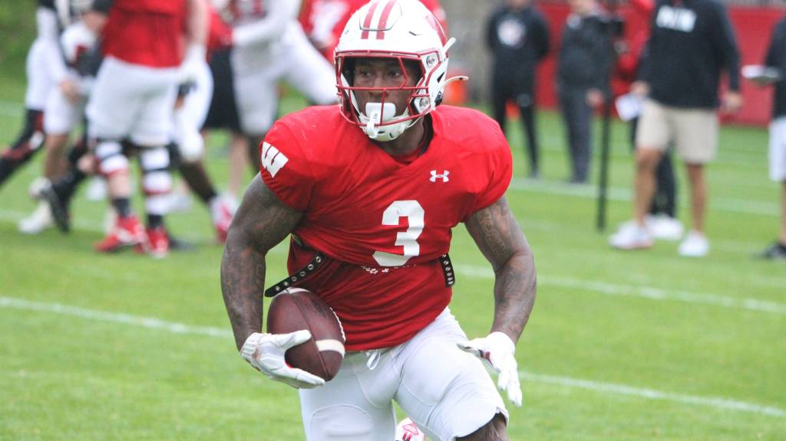

Looks like we benefitted from some really bad offense by Rutgers, but both our
offense and defense did what they needed to do. Mostly a fun watch! Other than
the latter part of 2nd quarter it looked good.

94 points in 2 weeks!

Wisconsin: 42\
Rutgers: 7

Tawee Walker! 198 yards

> For the second straight game Walker showed he could handle being the Badgers
> primary ball-carrier. Not only were his 198 rushing yards a career high, but
> also his 24 attempts.
>
> He had runs of 33 and 55 yards and had just two negative carries, one on which
> he slipped.
>
> Here are his numbers for the past two games: 43 carries, 292 yards, 6.9 yards
> per carry, six touchdowns.

[Running back Tawee Walker's huge day powers Wisconsin to second consecutive dominating victory](https://www.jsonline.com/story/sports/college/uw/2024/10/12/tawee-walkers-huge-day-powers-wisconsin-past-rutgers-in-big-ten-win/75630432007/)

<!--  -->
