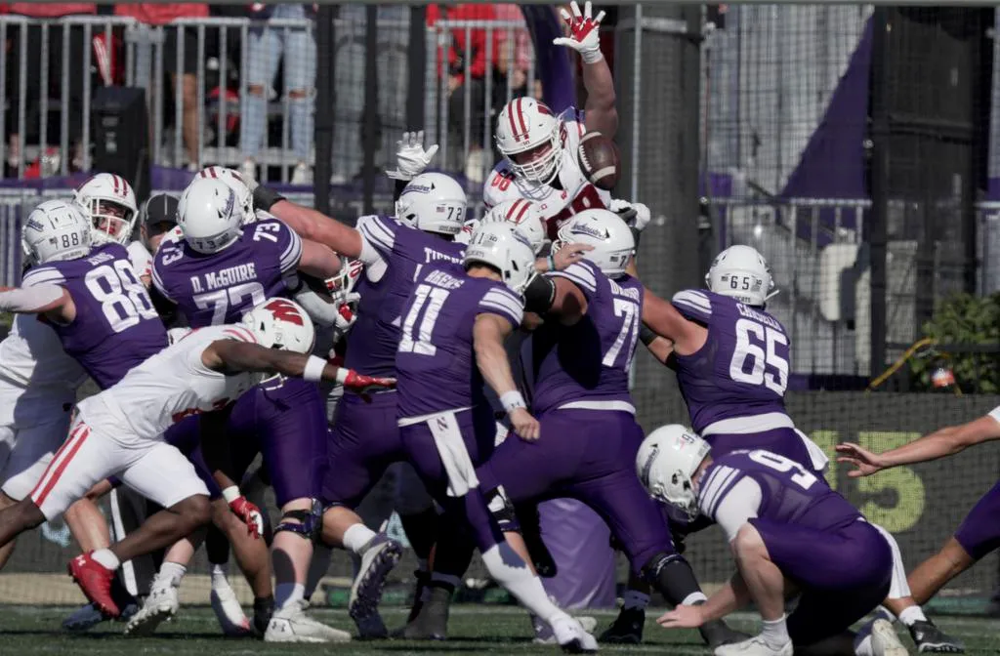

This one relied on some great defensive plays. A forced fumble with Northwestern
on their own goal line leads to a quick 7 for Wisconsin. And later the defense
gave us a safety. The defense continues to be stingy giving up only 16 points in
the last 3 games.

Wisconsin: 24\
Northewestern: 3

> The unit made two key stops during the first half.
>
> * After Locke threw an interception midway through the first quarter, the unit made sure Northwestern didn’t gain any momentum from the turnover. UW forced a three and out and allowed just 2 yards before the Wildcats punted.
>
> * The Wildcats started one possession in Wisconsin territory in the first half. They took over at the Badgers' 42 but didn’t get a first down. That drive ended with a 51-yard missed field goal by Luke Akers.

[Badgers football wins third straight Big Ten game](https://www.jsonline.com/story/sports/college/uw/2024/10/19/4-takeaways-from-wisconsin-badgers-23-3-victory-over-northwestern/75706710007/)

Shout out to special teams as well with a blocked field goal and a blocked punt.

<!--  -->
