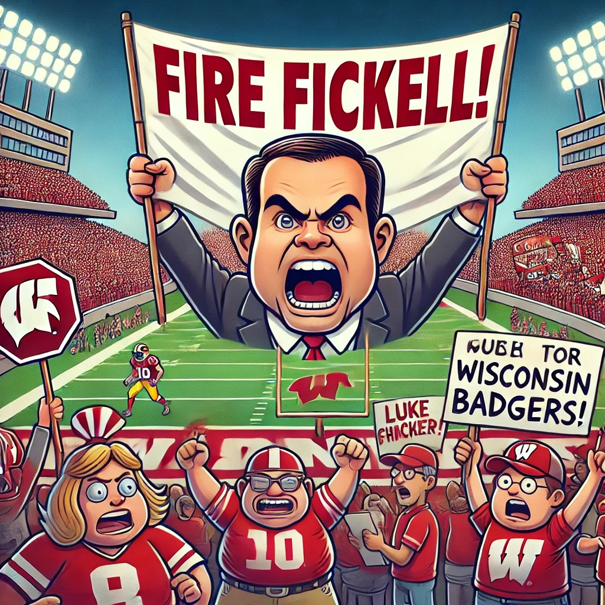

Well this is the worst team we've had since before Barry Alvarez. Alvarez may have lost more games his first season but it was obvious we were moving in the right direction. Fickell has wrecked this team in 2 years and most likely won't make it to a bowl game for the first time in over 2 decades.

The Air Raid destroyed 30 years of great offenses. The defense under the past 3 defensive coordinators were so good that we could barely keep a defensive coordinator on staff.

And now it all reliably sucks with just flashes of brilliance.

Maybe the AD should go to?
